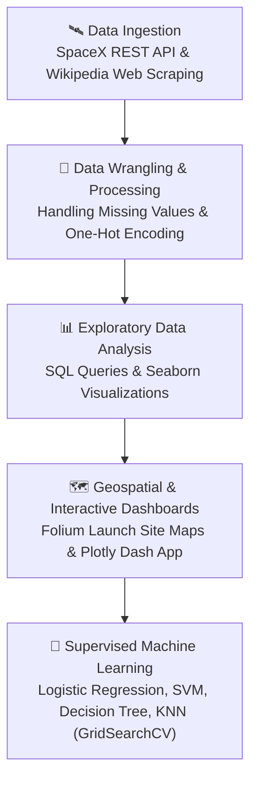
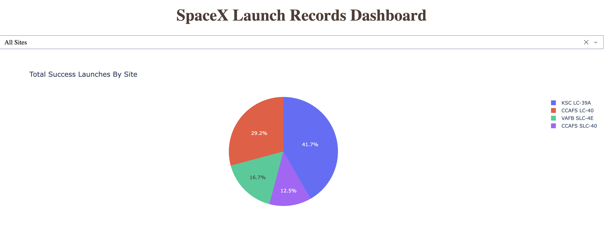
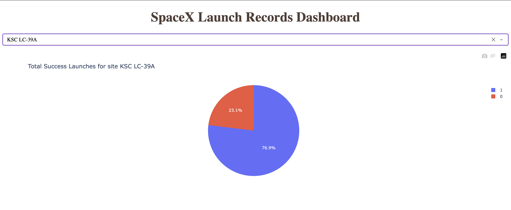
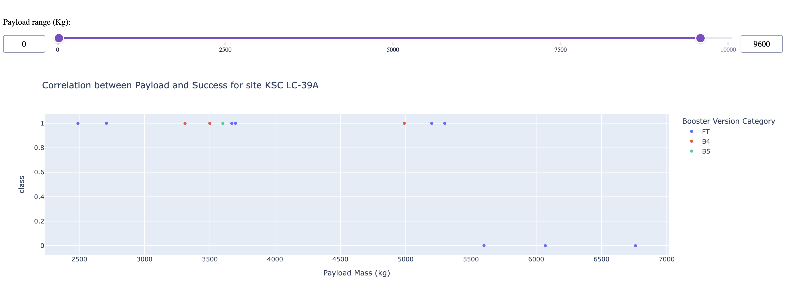

# SpaceX Falcon 9 First Stage Landing Prediction

An end-to-end data science capstone project predicting the success of SpaceX Falcon 9 first-stage booster landings to determine commercial launch competitiveness and payload-cost viability.

---

## Executive Summary

SpaceX advertises Falcon 9 rocket launches on its website with a cost of 62 million dollars; other providers cost upward of 165 million dollars each, much of the savings because SpaceX can reuse the first stage. Determining whether the first stage will land enables calculation of the actual launch cost. This project builds a machine learning pipeline that predicts whether a given booster will land successfully based on launch parameters, orbital dynamics, payload mass, and launch site constraints.

---

## Repository Structure

| File | Stage | Description |
| :--- | :--- | :--- |
| `01_spacex_data_collection_api.ipynb` | Data Collection | Extracted launch records from SpaceX REST API endpoints and decoded JSON payload data[cite: 7]. |
| `02_spacex_data_collection_webscraping.ipynb` | Web Scraping | Scraped historical Falcon 9 and Falcon Heavy launch records from Wikipedia using BeautifulSoup[cite: 7]. |
| `03_spacex_data_wrangling.ipynb` | Wrangling | Cleaned datasets, performed one-hot encoding, and engineered binary landing outcome labels[cite: 7]. |
| `04_spacex_eda_sql.ipynb` | Exploratory Analysis | Queried landing statistics, payload metrics, and booster version data using SQLite[cite: 7]. |
| `05_spacex_eda_dataviz.ipynb` | Visual Analytics | Generated exploratory visualizations using Pandas, Matplotlib, and Seaborn[cite: 7]. |
| `06_spacex_interactive_visual_analytics_folium.ipynb` | Geospatial Analytics | Built interactive maps with Folium to analyse proximity to coasts, launch sites, and transit links[cite: 7]. |
| `07_spacex_dash_interactive_app.py` | Interactive Dashboard | Developed a Plotly Dash web app with dynamic payload sliders and launch site filters[cite: 7]. |
| `08_spacex_machine_learning_prediction.ipynb` | Predictive Modeling | Trained, tuned, and evaluated supervised classification algorithms using GridSearchCV[cite: 7]. |

---

## Pipeline Overview



---

## Key Insights & Analytical Findings

* **Launch Site Success Rates**: Kennedy Space Center Launch Complex 39A (KSC LC-39A) demonstrated the highest overall launch and landing success rate among operational sites.
* **Payload Mass Trends**: Successful landings correlate strongly with light-to-medium payload masses (2,000 kg to 5,500 kg). Payloads exceeding 8,000 kg historically exhibited higher failure rates due to aggressive fuel constraints during re-entry burns.
* **Temporal Improvements**: First-stage recovery success rates increased significantly year-over-year after 2015, reflecting major hardware iterations from Falcon 9 v1.0/v1.1 to the Block 5 architecture.
* **Geographical Proximity**: Launch complexes are intentionally situated near coastal boundaries to allow easterly flight paths over open water, minimising safety risks to populated zones.

---

## Interactive Plotly Dash Application

The interactive web dashboard (`07_spacex_dash_interactive_app.py`) provides real-time launch success filtering:

### 1. Launch Site Success Distribution


### 2. Payload Mass vs. Success Correlation


### 3. Dashboard Overview


---

## Machine Learning Model Comparison

The target variable is binary: `Class = 1` (successful first-stage landing) or `Class = 0` (unsuccessful landing/expended booster). All models were trained with standard-scaled features and optimised via `GridSearchCV` using 10-fold cross-validation.

| Algorithm | Best Tuned Hyperparameters | Cross-Validation Accuracy | Test Set Accuracy |
| :--- | :--- | :--- | :--- |
| **Logistic Regression** | `C=0.01, penalty='l2', solver='lbfgs'` | 84.6% | 83.3% |
| **Support Vector Machine (SVM)** | `kernel='sigmoid', C=1.0, gamma='scale'` | 84.8% | 83.3% |
| **Decision Tree** | `criterion='gini', max_depth=4, splitter='best'` | 87.5% | 83.3% |
| **K-Nearest Neighbors (KNN)** | `n_neighbors=10, p=1, algorithm='auto'` | 84.8% | 83.3% |

> **Conclusion**: While all tuned classifiers achieved equivalent generalization accuracy (83.33%) on the holdout test dataset, the **Decision Tree Classifier** exhibited the best cross-validation performance during hyperparameter optimization.

---

## How to Run Locally

### 1. Clone the Repository
```bash
git clone [https://github.com/codemidas04/Data-Science-Capstone-.git](https://github.com/codemidas04/Data-Science-Capstone-.git)
cd Data-Science-Capstone-
```

### 2. Set Up Virtual Environment & Dependencies
Create and activate an isolated Python environment:
```bash
python3 -m venv venv
```

Activate the environment:
```bash
source venv/bin/activate
```

Install the required libraries:
```bash
pip install numpy pandas matplotlib seaborn plotly dash folium scikit-learn beautifulsoup4 requests
```

### 3. Launch the Dash Interactive Web App
Run the application server:
```bash
python3 07_spacex_dash_interactive_app.py
```
Open **`http://127.0.0.1:8050/`** in any browser to interact with the dashboard.

---

## Tech Stack
* **Languages**: Python 3.x, SQL
* **Data Ingestion**: Requests (REST API), BeautifulSoup (Web Scraping)
* **Data Processing**: Pandas, NumPy
* **Visualization & Dashboards**: Matplotlib, Seaborn, Folium, Plotly, Plotly Dash
* **Machine Learning**: Scikit-Learn (Logistic Regression, Support Vector Classifier, Decision Trees, KNN, GridSearchCV)

---

## Author
* **GitHub**: [@codemidas04](https://github.com/codemidas04)
